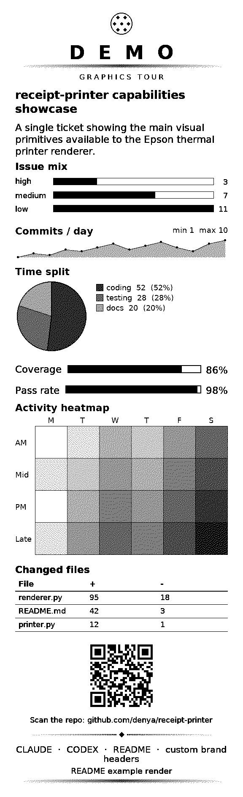
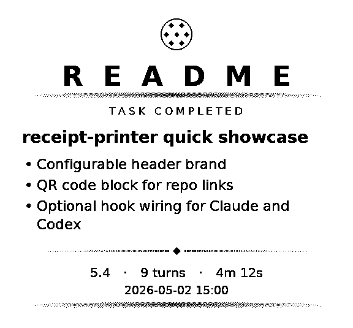

# receipt-printer

## Intro Pitch

Problem: good AI work disappears into chat history, logs, and terminals.

Solution: `receipt-printer` turns finished sessions and hand-picked reports into small physical tickets on a thermal printer.

Benefits: you get a durable artifact, a fast way to print polished summaries manually, and optional Claude/Codex automation when you actually want it.

Examples:

<table>
  <tr>
    <td align="center">
      
    </td>
    <td align="center">
      
    </td>
  </tr>
  <tr>
    <td align="center">
      
    </td>
    <td align="center">
      
    </td>
  </tr>
</table>

## For Humans

### Pick your mode

| If you want... | Use |
|---|---|
| manual printing to an existing printer server | client-side `curl` requests only |
| automatic Claude/Codex receipts | client-side hook wiring, optionally |
| your own printer host | `server/` on a Pi or other Linux machine |
| one-MacBook preview/manual mode | local dry-run server |

### Manual printing

If you already have a server with a printer attached somewhere, this is the simplest path.

```bash
export PRINTER_URL="http://100.78.6.79:9100"
curl "$PRINTER_URL/health"
curl -X POST "$PRINTER_URL/print/session" \
  -H 'Content-Type: application/json' \
  -d '{"brand":"README","title":"Manual print","results":["Manual mode is enough for many users"]}'
```

Use `/print/session` for clean branded summary slips and `/print/rich` when you want charts, QR codes, tables, ornaments, and custom layouts.

### Run your own server

The first-class physical-printer path is a Raspberry Pi or other Linux box with the Epson exposed as `/dev/usb/lp0`.

```bash
git clone https://github.com/denya/receipt-printer.git
cd receipt-printer/server
cp .env.example .env
docker compose up -d --build
curl -sf http://127.0.0.1:9100/health
```

Recommended `.env`:

```dotenv
PRINTER_DEVICE=/dev/usb/lp0
PRINTER_WIDTH_CHARS=48
PRINTER_DRY_RUN=0
```

If you want to build your own compatible version instead of using this repo directly, use [spec.md](./spec.md).

### Single-machine MacBook mode

If you just want to preview layouts, iterate on tickets, or manually trigger reports from one MacBook, use dry-run mode:

```bash
cd server
python3 -m venv ../.venv
. ../.venv/bin/activate
pip install -r requirements.txt
PRINTER_DRY_RUN=1 uvicorn main:app --host 127.0.0.1 --port 9100
```

Then:

```bash
curl http://127.0.0.1:9100/health
curl -X POST http://127.0.0.1:9100/print/session \
  -H 'Content-Type: application/json' \
  -d '{"brand":"README","title":"Dry run","results":["No physical printer required"]}'
```

### Optional automation

Hook wiring is optional. Skip it if you only want manual printing.

Claude Code:

```bash
mkdir -p ~/.claude/hooks
cp client/print-session.sh ~/.claude/hooks/print-session.sh
chmod +x ~/.claude/hooks/print-session.sh
```

Codex:

```bash
mkdir -p ~/.codex/hooks
cp client/print-codex-notify.py ~/.codex/hooks/print-codex-notify.py
chmod +x ~/.codex/hooks/print-codex-notify.py
```

The Claude hook uses `SessionEnd`. The Codex hook uses the global `notify` surface and keeps the existing oh-my-codex notify chain intact.

## For Agents

### Use the right surface

- Use `/print/session` for “task done” slips with `brand`, `title`, `results`, `model`, `turns`, and `duration`.
- Use `/print/rich` for composed tickets with charts, tables, ornaments, progress bars, heatmaps, and QR codes.
- Use `/print/test` when you need to verify hardware separately from the renderer.
- Use `/health` before longer or higher-value runs.

### Current capabilities

- Configurable session header brand: `CLAUDE`, `CODEX`, `README`, or any short label.
- Rich ticket blocks: `header`, `title`, `text`, `bullets`, `bar_chart`, `sparkline`, `pie_chart`, `progress_bar`, `heatmap`, `table`, `qr_code`, `ornament`, `spacer`.
- QR codes can link back to the repo or docs directly from paper.
- Dry-run mode supports local testing without a physical printer.

### Where to look

- [server/SKILL.md](./server/SKILL.md) is the caller contract for `/print/rich` composition.
- [spec.md](./spec.md) is the build-from-scratch contract if you want to recreate the system or implement your own compatible version.
- `examples/` contains real ticket photos and renderer outputs you can reference when designing new layouts.

### Minimal examples

Session ticket:

```bash
curl -X POST http://100.78.6.79:9100/print/session \
  -H 'Content-Type: application/json' \
  -d '{"brand":"CODEX","title":"Repo shipped","results":["Hook installed","Pi updated"]}'
```

Rich ticket with QR:

```bash
curl -X POST http://100.78.6.79:9100/print/rich \
  -H 'Content-Type: application/json' \
  -d '{"blocks":[
    {"type":"header","title":"README","subtitle":"SCAN ME"},
    {"type":"title","content":"receipt-printer"},
    {"type":"qr_code","data":"https://github.com/denya/receipt-printer","label":"github.com/denya/receipt-printer"}
  ]}'
```
