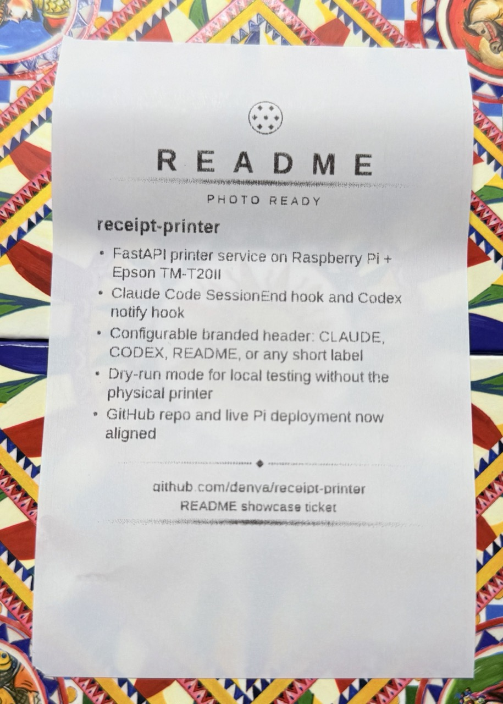

# receipt-printer

Print Claude Code session receipts on a thermal printer at home.

This repo has two parts:

- `server/` — a FastAPI service that runs on a Raspberry Pi and talks to an Epson TM-T20II over `/dev/usb/lp0`
- `client/print-session.sh` — a Claude Code `SessionEnd` hook that decides whether a session is worth printing, then POSTs a receipt to the server

The current live target is the Raspberry Pi at `100.78.6.79`, where the standalone deployment lives in `/home/denya/receipt-printer-service/`.

## Repo layout

```text
receipt-printer/
├── README.md
├── examples/
├── spec.md
├── client/
│   └── print-session.sh
└── server/
    ├── .env.example
    ├── Dockerfile
    ├── docker-compose.yml
    ├── main.py
    ├── printer.py
    ├── renderer.py
    ├── requirements.txt
    ├── schemas.py
    └── tests/
```

## Example tickets

Physical ticket photo:



Renderer output examples:


## What the server exposes

- `GET /health` — reports whether the service is ready
- `POST /print/test` — text-only printer smoke test
- `POST /print/text` — print plain text
- `POST /print/session` — print a Claude session receipt
- `POST /print/rich` — print arbitrary rendered blocks

Example:

```bash
curl http://100.78.6.79:9100/health
curl -X POST http://100.78.6.79:9100/print/test
curl -X POST http://100.78.6.79:9100/print/session \
  -H 'Content-Type: application/json' \
  -d '{"brand":"CLAUDE","title":"Shipped fix","results":["Reviewed code","Patched bug"]}'
```

## How To Install

Start by choosing the mode that matches what you actually want.

| Goal | What you install | Hook wiring |
|---|---|---|
| You already have a printer server somewhere and only want to print nice reports manually | client-side commands only | no |
| You already have a printer server somewhere and want automatic Claude/Codex session receipts | client-side commands + optional hooks | yes |
| You want to run your own printer server | `server/` on a Pi/Linux box, then optional clients | optional |
| You are on one MacBook and just want to experiment, preview layouts, or manually trigger reports | local dry-run server or an existing remote server | no by default |

### 1. Manual use against an existing printer server

This is the simplest path. No hook wiring, no automatic printing, just manual report printing when you want it.

```bash
export PRINTER_URL="http://100.78.6.79:9100"
curl "$PRINTER_URL/health"
curl -X POST "$PRINTER_URL/print/session" \
  -H 'Content-Type: application/json' \
  -d '{"brand":"README","title":"Manual print","results":["Manual mode is enough for many users"]}'
```

For richer layouts, use `/print/rich` and build the ticket out of blocks. The contract for that lives in [server/SKILL.md](./server/SKILL.md).

### 2. Optional hook wiring for automatic session receipts

Only do this if you explicitly want Claude Code or Codex to print automatically after useful sessions. If you only want manual reports, stop after step 1.

#### Claude Code

```bash
mkdir -p ~/.claude/hooks
cp client/print-session.sh ~/.claude/hooks/print-session.sh
chmod +x ~/.claude/hooks/print-session.sh
```

Example `~/.claude/settings.json` snippet:

```json
{
  "hooks": {
    "SessionEnd": [
      {
        "hooks": [
          {
            "type": "command",
            "command": "/Users/denya/.claude/hooks/print-session.sh"
          }
        ]
      }
    ]
  }
}
```

Useful env vars:

- `PRINTER_URL` — defaults to `http://100.78.6.79:9100/print/session`
- `ANTHROPIC_API_KEY` — enables the Haiku print-worthiness filter
- `PRINT_FILTER=off` — bypasses the filter and prints every session

#### Codex

Codex does not expose the same session-end hook here. The practical surface is the global `notify` callback after each completed turn.

```bash
mkdir -p ~/.codex/hooks
cp client/print-codex-notify.py ~/.codex/hooks/print-codex-notify.py
chmod +x ~/.codex/hooks/print-codex-notify.py
cp ~/.codex/config.toml ~/.codex/config.toml.bak-receipt-hook
```

Then change `notify = [...]` in `~/.codex/config.toml` so `--previous-notify` points at:

```json
["/Users/denya/.codex/hooks/print-codex-notify.py"]
```

The wrapper keeps the existing oh-my-codex notify chain intact and only adds printing on top.

### 3. Run your own server

If you want a real physical printer host, the supported path today is a Raspberry Pi or another Linux machine with the Epson exposed as `/dev/usb/lp0`.

The standalone service on the live Pi is deployed into:

```text
/home/denya/receipt-printer-service/
```

#### Quick path: use this repo directly

```bash
git clone https://github.com/denya/receipt-printer.git
cd receipt-printer/server
cp .env.example .env
docker compose up -d --build
curl -sf http://127.0.0.1:9100/health
```

Recommended `.env`:

```dotenv
PRINTER_DEVICE=/dev/usb/lp0
PRINTER_WIDTH_CHARS=48
PRINTER_DRY_RUN=0
```

#### Build-your-own path: use the spec

If you do not want to use this repo directly, [`spec.md`](./spec.md) is the full build-from-scratch contract: architecture, endpoints, request shapes, rendering expectations, hardware assumptions, and deployment order.

Use that path when you want your own implementation but compatible client behavior.

#### Updating a standalone Pi deployment

```bash
rsync -av \
  --exclude '__pycache__/' \
  --exclude '.env' \
  ./server/ denya@100.78.6.79:/home/denya/receipt-printer-service/

ssh denya@100.78.6.79 '
  cd /home/denya/receipt-printer-service &&
  docker compose up -d --build &&
  curl -sf http://127.0.0.1:9100/health
'
```

### 4. Single-machine MacBook mode

If you are on one working MacBook with Claude/Codex and only want to design tickets, test rendering, or manually trigger nice reports, use local dry-run mode.

```bash
cd server
python3 -m venv ../.venv
. ../.venv/bin/activate
pip install -r requirements.txt
PRINTER_DRY_RUN=1 uvicorn main:app --host 127.0.0.1 --port 9100
```

Then in another terminal:

```bash
curl http://127.0.0.1:9100/health
curl -X POST http://127.0.0.1:9100/print/session \
  -H 'Content-Type: application/json' \
  -d '{"brand":"README","title":"Dry run","results":["No physical printer required"]}'
```

This is the recommended same-laptop mode for README work, layout iteration, and manual ticket experiments.

If you need actual paper output, the current first-class hardware path is still a Linux/Pi printer host. On macOS, the practical setup is usually:

1. Claude/Codex run on the MacBook.
2. The printer service runs on a Pi or other Linux host.
3. The MacBook talks to that server over `PRINTER_URL`.

## Local development

Create a virtualenv and install the server dependencies:

```bash
cd server
python3 -m venv ../.venv
. ../.venv/bin/activate
pip install -r requirements.txt
```

Run the tests:

```bash
. ../.venv/bin/activate
python -m unittest discover -s tests -v
```

## Configurable header brand

`/print/session` now accepts a `brand` field, so the large header can be `CLAUDE`, `CODEX`, `README`, or any other short label.

Example:

```bash
curl -X POST http://100.78.6.79:9100/print/session \
  -H 'Content-Type: application/json' \
  -d '{"brand":"CODEX","title":"Repo shipped","results":["Hook installed","Pi updated"]}'
```

## QR codes in rich tickets

`/print/rich` now supports a `qr_code` block, so tickets can include a scannable link to the repo or docs.

```bash
curl -X POST http://100.78.6.79:9100/print/rich \
  -H 'Content-Type: application/json' \
  -d '{"blocks":[
    {"type":"header","title":"README","subtitle":"SCAN ME"},
    {"type":"title","content":"receipt-printer"},
    {"type":"qr_code","data":"https://github.com/denya/receipt-printer","label":"github.com/denya/receipt-printer"}
  ]}'
```

## Current improvements in this repo

- Font loading now falls back cleanly outside the container instead of crashing on hardcoded Linux font paths.
- Rich-block rendering now survives renderer failures and prints an inline error tag instead of failing the whole request.
- Table blocks now expand for wrapped cell content instead of silently truncating after the first line.
- Dry-run mode makes local verification possible without a physical printer.
- Focused unit tests protect the renderer and dry-run service behavior.

See [`spec.md`](./spec.md) for the full system spec and design notes.
